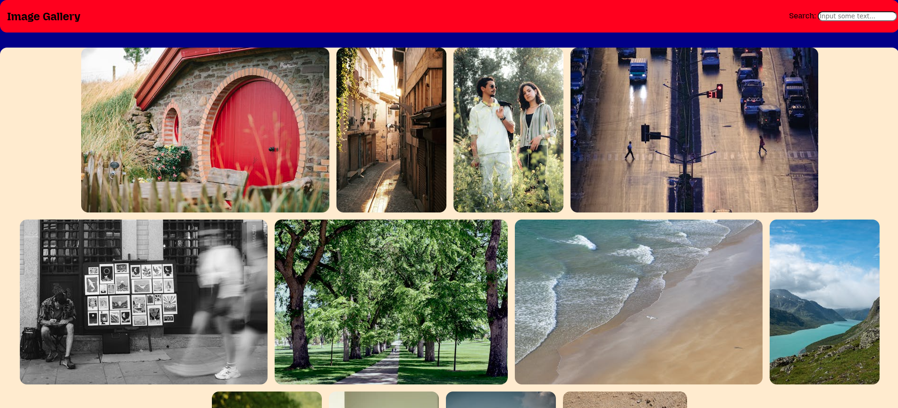

## 📸 Image Gallery with Pexels API

An interactive image gallery that fetches and displays high-quality photos from the **Pexels API**.  
Includes a **lightbox viewer**, **previous/next navigation**, and **search functionality**.

---

## 🚀 Live Demo
[View on GitHub Pages](https://yari4ek89.github.io/imagegalleryapi-site/)  
*(Replace with your actual link)*

---

## ✨ Features
- 🔍 **Search Images** — Fetch images by keyword from the Pexels API.
- 🖼 **Lightbox Mode** — View images in fullscreen with smooth animations.
- ⬅➡ **Navigation** — Switch between images with previous/next buttons.
- 📱 **Responsive Design** — Optimized for desktop, tablet, and mobile.
- 🎨 **Hover Effects** — Smooth scaling animation on image hover.

---

## 🛠 Tech Stack
- **HTML5**
- **CSS3**
- **JavaScript (Vanilla)**
- **Pexels API**

---

## 📦 Installation & Usage
1. **Clone the repository**
   ```bash
   git clone https://github.com/yari4ek89/your-repo-name.git

2. **Open index.html in your browser**

## 🔑 API Key Setup
This project uses the [Pexels API](https://www.pexels.com/api/).
To run it with your own API key:
- Create a free Pexels account.
- Get your API key.
- Replace the value of PEXELS_API in script.js:
    ```javascript
    const PEXELS_API = 'YOUR_API_KEY_HERE';

## 📸 Screenshots


## 📄 License
This project is open-source and available under the MIT License.